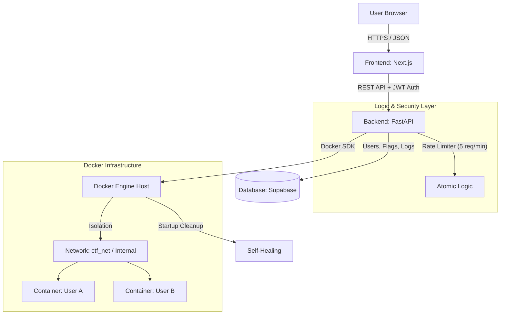

# Project Identity: "Docker-First CTF" Holistic Master Plan (Ver 5.0c)

## 1. Executive Summary & Vision

* **Project Name:** Docker-First CTF (CodeName: Project_Sol)
* **Mission:** 日本の理系学生・若手エンジニアに対し、インフラ構築・防御・コンテナ技術を「物語（Story）」の中で学べる没入型実践環境を提供する。
* **Solopreneur Philosophy:**

  * 管理者（User）は「AIの手足」となり、意思決定と物理的な実装操作に徹する。
  * 設計段階で例外処理を網羅し、手戻りを極限まで減らす「堅牢なMVP」を目指す。
* **Core Experience (Narrative):**

  * **Role:** ユーザーは「セキュリティ機関のエージェント」として参加。
  * **Action:** 単なる "Question" ではなく "Mission" を遂行する。
  * **Gamification:** UI/UXを通じて没入感を高め、学習の苦痛を取り除く。

---

## 2. Design System & UI/UX Guidelines (Strict for AI)

AIによるデザインのブレを防ぐため、以下のルールを絶対遵守すること。

### A. Visual Theme: "Modern Cyberpunk / Terminal"

* **Concept:** 黒を基調とした、清潔感のあるハッカースタイル。過度な装飾は避け、実用的なダッシュボード（Glassmorphism）を目指す。
* **UI Library:** `shadcn/ui` (Radix UI + Tailwind CSS) を全面採用する。
* **Color Palette (Tailwind):**

  * **Background:** `zinc-950` (ほぼ黒)
  * **Card/Surface:** `zinc-900` with borders `zinc-800`
  * **Primary Accent:** `emerald-500` (成功、正常、CUIの文字色)
  * **Destructive:** `rose-500` (エラー、攻撃検知)
  * **Text:** `zinc-100` (本文), `zinc-400` (補足)
* **Typography:**

  * Headers: `Inter` (Sans-serif)
  * Code/Terminal: `JetBrains Mono` or `Fira Code` (Monospace)

### B. User Experience (UX)

* **Feedback:** 操作時には必ず視覚的なフィードバック（トースト通知、ローディング）を行う。
* **Onboarding:** 初回ログイン時に「エージェント登録シークエンス」のような演出を入れる。

---

## 3. Technical Architecture & Stack

### A. System Overview



### B. Technical Stack

* **Frontend:** Next.js (App Router), Tailwind CSS, Shadcn/UI, Lucide React
* **Backend:** Python (FastAPI) with Docker SDK, `slowapi` (Rate Limiter)
* **Database:** Supabase (PostgreSQL + Auth)
* **Infrastructure:** VPS (Ubuntu), Docker Engine

---

## 4. Security & Robustness Protocols (From Ver 4.1)

以下は **最低限必須の技術仕様**。

### 4.1 Resource Limits (Anti-Mining)

全ユーザーコンテナに対して：

```
cpus="0.5"
mem_limit="128m"
```

を強制し、過負荷・マイニング利用を防ぐ。

---

### 4.2 Network Isolation (Defense)

Docker起動前に必ず：

```
docker network create --internal ctf_net
```

ユーザーコンテナは **必ずこのネットワークに接続**する。

→ コンテナは外部インターネットへ到達できない。

---

### 4.3 Socket Safety

ユーザーコンテナに：

❌ `docker.sock` を絶対マウントしない。
→ ホスト操作を完全遮断。

---

### 4.4 Rate Limiting (DDoS Protection)

FastAPI + `slowapi` により：

```
5 requests/minute
```

を基本とする。

対象API例：

* コンテナ起動
* コンテナ停止
* フラグ送信（Answer）

---

## 5. Implementation Specifications (The Logic)

AIがコード生成する際に必ず守るべき定義。

---

### 5.1 Port Allocation & Atomic Startup Strategy

**「成功」か「痕跡ゼロで完全失敗」かの二択。**

```python
try:
    # 1. Port 0でコンテナ起動 (Docker任せで競合回避)
    container = client.containers.run(
        ...,
        ports={'8000/tcp': ('0.0.0.0', 0)}
    )

    # 2. ポート確認
    container.reload()
    assigned_port = container.ports['8000/tcp'][0]['HostPort']

    # 3. DB保存
    save_to_db(user_id, container.id, assigned_port)
    return {"status": "success", "port": assigned_port}

except Exception:
    # 失敗時は即座にゴミ掃除 (Rollback)
    if container:
        container.remove(force=True)
    raise HTTPException(500, "Mission Start Failed")
```

---

### 5.2 Container TTL & Self-Healing Strategy

* **Scheduler:** FastAPI内の `APScheduler`
* **タイミング:**

  1. APIサーバー起動（lifespan）
  2. 5分間隔Cron

#### Startup Cleanup

起動時：

1. DB上のコンテナ一覧
2. `docker ps`

を照合し、存在しないものはDBから削除。

#### Routine Cleanup

```
current_time - start_time > 30min
```

のコンテナを `kill & rm`。

---

### 5.3 Challenge Image Specification

* **Base:** `python:3.11-slim`
* **Internal Port:** `8000`固定
* **Flag注入:**

```
ENV CTF_FLAG=flag_xxxxx
```

---

## 6. Phase Definition & Roadmap

### Phase 1: MVP Prototyping (Current Focus)

**Goal:**
ローカル(WSL)で

* 黒基調UI（Identity）
* 実用的な堅牢コンテナ起動（Robustness）

が接続して動く状態を完成させる。

#### Steps

1. **Frontend (`/web`)**

   * Next.js 構築
   * Tailwind + shadcn/ui
   * Zinc/Emeraldテーマ適用

2. **Backend (`/api`)**

   * FastAPI + Docker SDK
   * `slowapi`導入
   * Atomic起動処理実装

3. **Integration**

   * UIの **"Mission Start"** ボタンからAPI発火

---

## 7. Recovery Checklist (Bus Factor Mitigation)

半年後の自分が「何も憶えていなくても復帰できる」ための診断。

* [ ] `docker compose up` でDBとBackendが起動する
* [ ] `ctf_net` が存在する
* [ ] フロントで黒基調UIが表示される
* [ ] Mission Startでポート番号が返る
* [ ] 連打してもRate Limitで弾かれる
* [ ] Backend再起動時に古いコンテナが消える

---

# End of Master Plan
